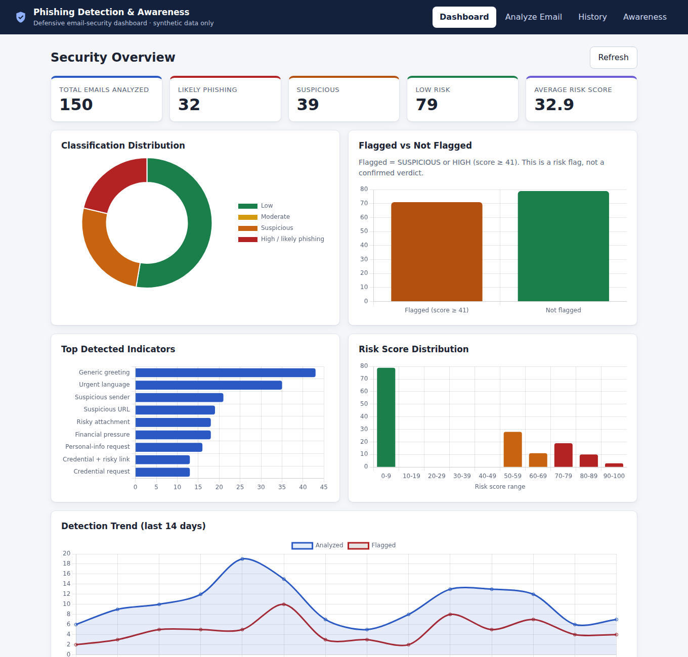
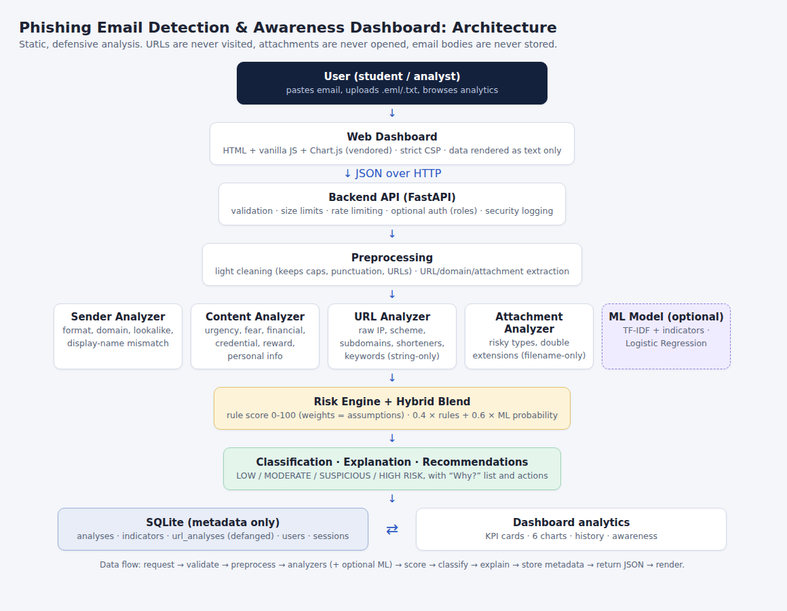
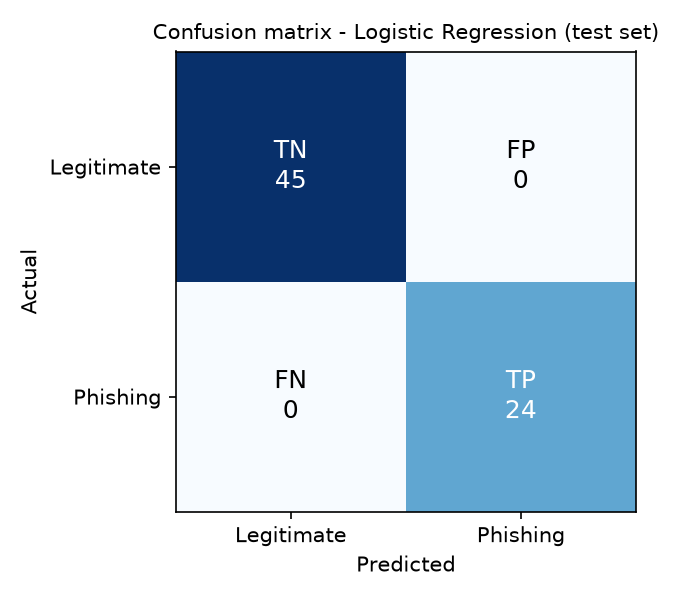
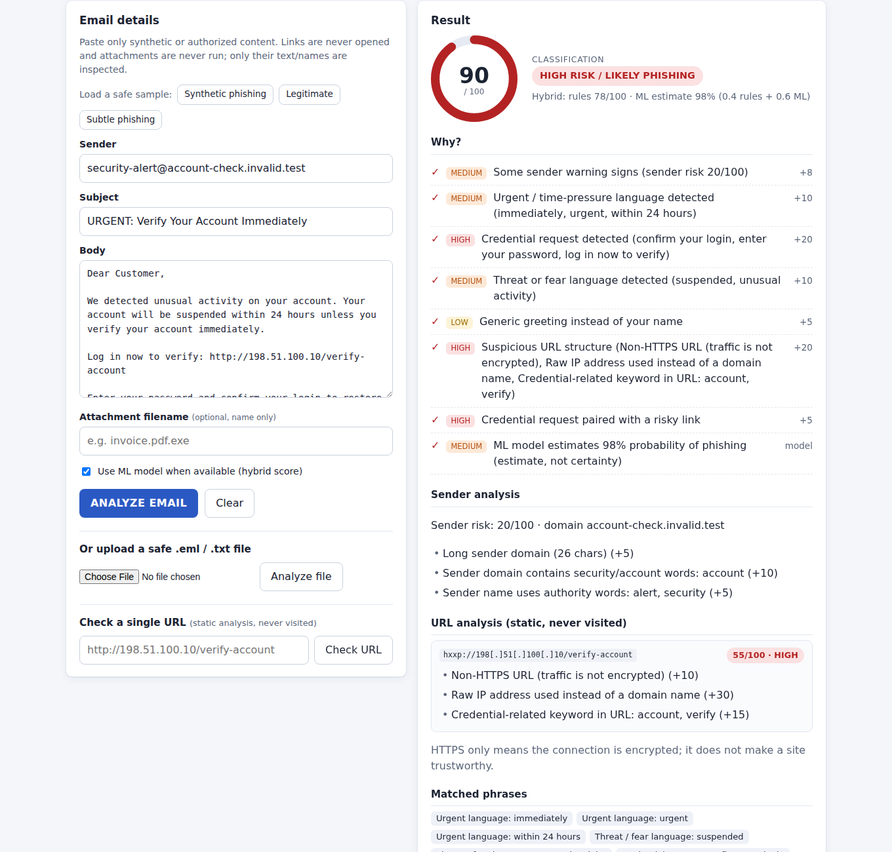
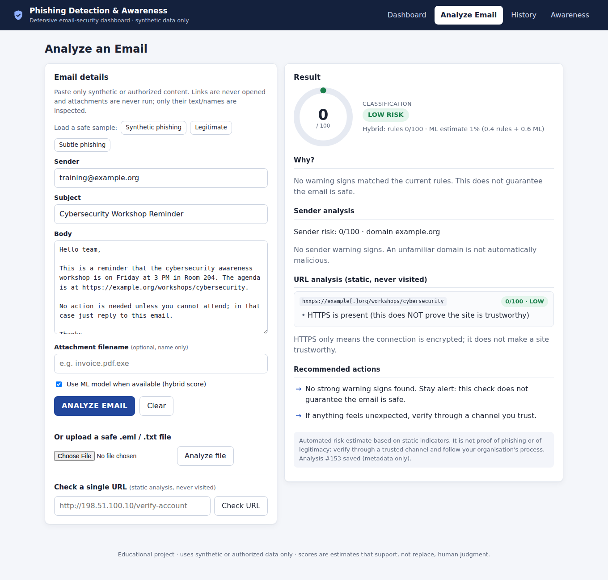
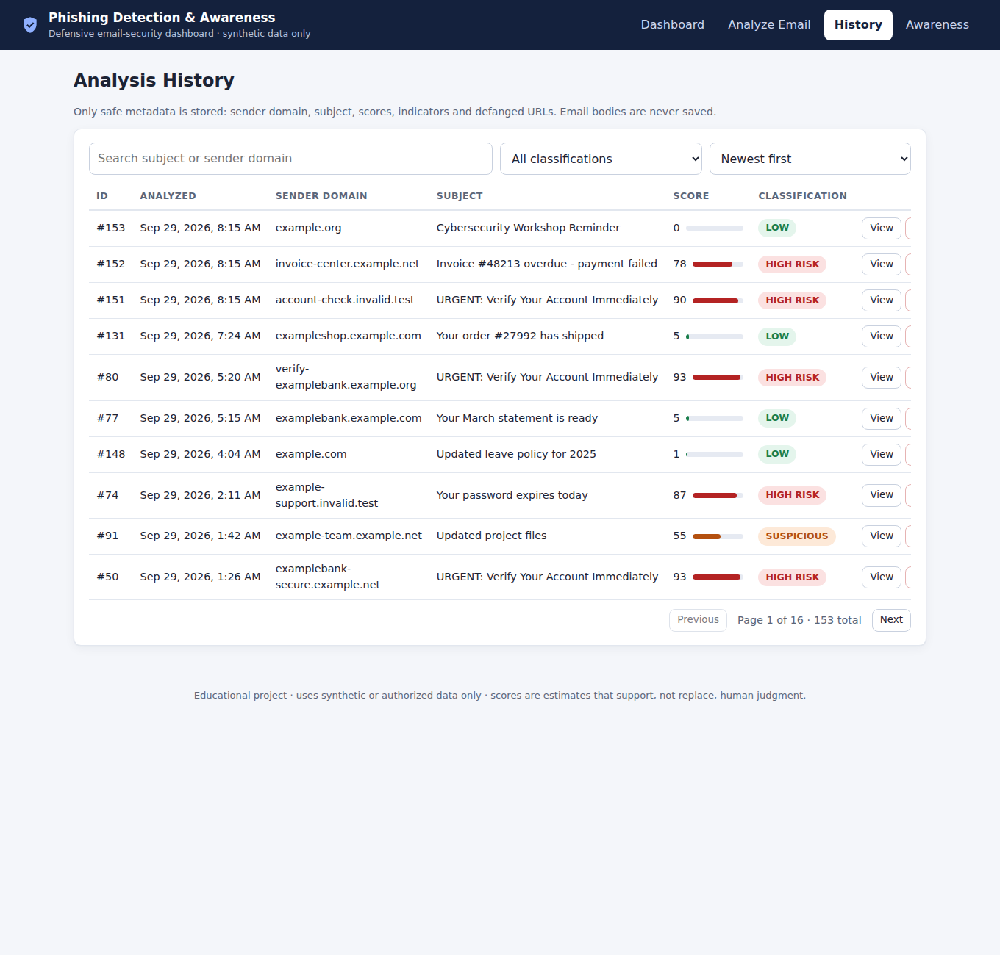
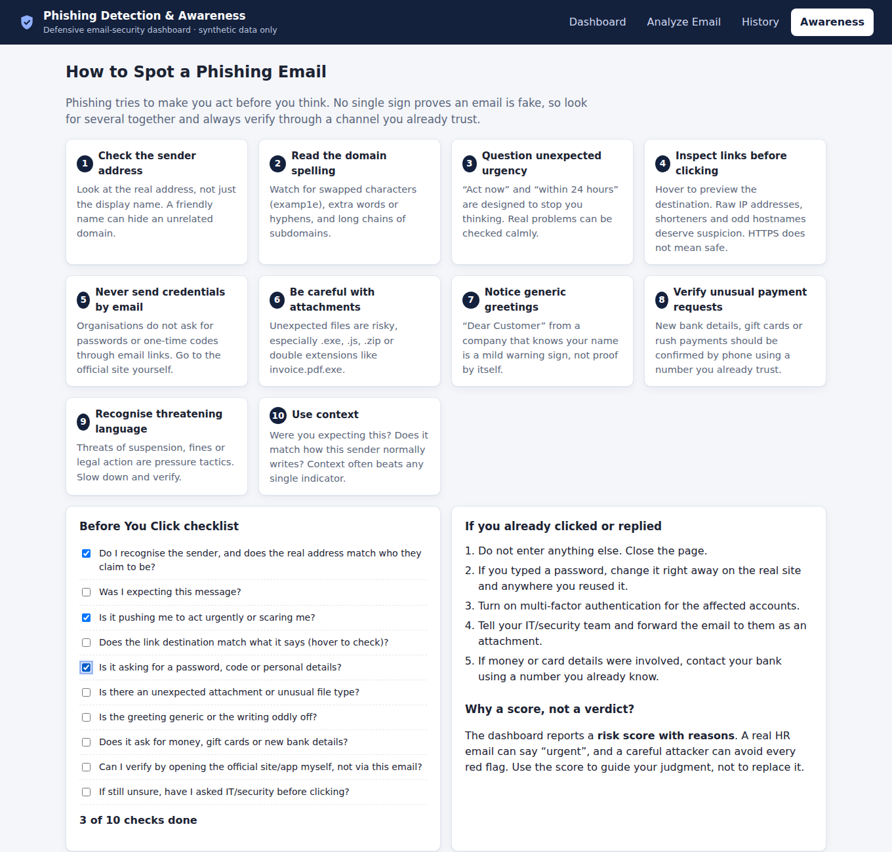

# Phishing Email Detection & Awareness Dashboard

> Defensive cybersecurity dashboard for analyzing synthetic email content, sender patterns, URLs, attachments, and social-engineering indicators to generate explainable phishing risk assessments.



## Overview
A complete, runnable phishing-analysis system: a Python/FastAPI backend that scores emails with transparent rules plus an optional machine-learning model, a SQLite history that stores **metadata only**, and a browser dashboard with analytics and a phishing-awareness module. Everything runs on a laptop with free tools and **synthetic data only**.

## Problem Statement
Email is a leading initial-access vector. Detection tools that output only "phishing / not phishing" are hard for analysts to trust and teach users nothing. This project produces a **risk score with reasons and recommended actions**, and turns detections into awareness content.

## Objectives
1. Detect phishing indicators in sender, subject, body, URLs and attachment names.
2. Produce an explainable 0–100 risk score and classification.
3. Compare rule-based, machine-learning and hybrid detection with honest evaluation.
4. Store analysis history safely and visualise trends.
5. Teach users how to spot phishing.
6. Apply secure-coding and privacy practices throughout.

## Features
- Paste email fields or upload a safe `.eml`/`.txt`; optional attachment filename
- Sender, content, URL and attachment analyzers with explanations
- Risk score, four-level classification, ✓ "Why?" list, recommended actions
- Optional ML (TF-IDF + indicators) and hybrid scoring
- History with search, filter, sort, pagination, detail view and delete
- Dashboard: 5 KPI cards + 6 charts
- Awareness module: 10 tips, "Before You Click" checklist, "if you already clicked" guide
- REST API with validation, rate limiting and optional authentication (roles)
- 98 automated tests

## Cybersecurity Relevance
Mirrors how secure email gateways, SOC phishing triage and awareness platforms work: multi-signal detection, explainable scoring, analyst review, user education. See [`docs/CONCEPTS.md`](docs/CONCEPTS.md) for roles (SOC, email security, threat intel, IR) and the MITRE ATT&CK mapping (Phishing **T1566**: Spearphishing Attachment, Link, via Service, Voice).

## Architecture


Details: [`docs/ARCHITECTURE.md`](docs/ARCHITECTURE.md).

## Technology Stack
Python 3.10+ · FastAPI · Pydantic · SQLite (stdlib) · scikit-learn · pandas · matplotlib · vanilla JavaScript · Chart.js (vendored, no CDN) · pytest · Playwright (optional, browser tests/screenshots).

## Dataset
Generated by `data/generate_dataset.py` (seeded, reproducible): **600 rows** (343 legitimate / 257 phishing), **455 after de-duplication** (297 / 158). Nine legitimate categories (university notice, HR update, urgent-sounding HR update, project update, meeting reminder, shopping confirmation, newsletter, password-change confirmation, fictional-bank notice) and nine phishing categories (fake account verification, invoice, prize, password expiry, delivery, HR request, executive request, plus two deliberately *subtle* types). Only reserved/fictional domains (`example.com/.org/.net`, `*.invalid.test`, `*.example`) and documentation-range IPs are used; a test enforces this. Statistics: [`docs/dataset_stats.txt`](docs/dataset_stats.txt). Columns: `email_id, sender, sender_domain, subject, body, urls, attachment_name, label` (+ `category`).

## Phishing Indicators
Sender, subject/body, URL and attachment indicators are listed in [`docs/CONCEPTS.md`](docs/CONCEPTS.md#3-indicators-implemented). **No single indicator proves phishing**; the engine combines signals and reports uncertainty.

## Sender Analysis
`analyze_sender()` checks address format, domain length, subdomains, hyphens, punycode, letter/digit mixing, security words, brand names in untrusted domains, character-swap lookalikes (`examp1ebank`) and display-name mismatches. Returns `sender_risk_score` and `sender_findings[]`. Unfamiliar domains are **not** automatically penalised.

## Email Content Analysis
`analyze_email_content()` detects urgency, fear/threats, financial pressure, credential requests, reward claims, personal-information requests, generic greetings, ALL-CAPS and excessive punctuation, and returns each finding with evidence and an explanation.

## URL Analysis
`analyze_url()` performs **static string analysis only** (never visits links): scheme, host, path, query, lengths, subdomains, raw/obfuscated IPs, shorteners, credential keywords, `@` tricks, punycode, ports, percent-encoding, brand misuse, and link-text/destination mismatch. **HTTPS does not mean trustworthy**, so it is reported as neutral information. URLs are stored and shown defanged (`hxxp://198[.]51[.]100[.]10/...`).

## Attachment Analysis
`analyze_attachment()` inspects the **filename only**: executables, scripts, macro-enabled Office files, archives/disk images, HTML, and double extensions such as `invoice.pdf.exe`. Attachments are never opened or executed.

## Risk Scoring
`calculate_phishing_score()` sums weighted indicators (cap 100):

| Indicator | Points | Indicator | Points |
|---|---|---|---|
| Credential request | 20 | Suspicious URL (high / medium) | 20 / 10 |
| Suspicious attachment (high / medium) | 25 / 12 | Suspicious sender (high / medium) | 15 / 8 |
| Urgency | 10 | Threat/fear | 10 |
| Financial pressure | 10 | Reward claim | 10 |
| Personal-info request | 10 | Link-text mismatch | 10 |
| Generic greeting | 5 | Unusual formatting | 5 |
| Credential + risky link (combination) | 5 | | |

Classes: **0–20 LOW RISK · 21–40 MODERATE · 41–70 SUSPICIOUS · 71–100 HIGH RISK / LIKELY PHISHING.** These weights and thresholds are **project assumptions**, not calibrated on real mail; production use would calibrate them on validation data and analyst feedback.

## Machine Learning
`python ml/train_model.py` trains Logistic Regression, Naive Bayes and Random Forest on TF-IDF text plus the structured indicators, using a stratified 70/15/15 split (318/68/69 rows). The model is chosen on **validation** F1 and reported on the untouched **test** set. A **leave-one-phishing-category-out stress test** checks generalisation. **Hybrid** score = 0.4 × rules + 0.6 × ML probability (weights are assumptions). ML output is an estimate, not certainty. Full generated report: [`docs/ml_results.md`](docs/ml_results.md).



## Explainable Detection
Every result shows the score, class, a ✓ list of triggered indicators with severity and points, sender/URL/attachment findings, matched phrases and recommended actions, so analysts can verify and users can learn.

## Dashboard
KPI cards (Total, Likely Phishing, Suspicious, Low Risk, Average Score) and six charts: classification distribution, flagged vs not flagged, top indicators, score distribution, 14-day trend, most common suspicious keywords. Screenshots below.

## Security Awareness
The **Awareness** tab teaches ten checks (sender, domain spelling, urgency, links, credentials, attachments, greetings, payment requests, threats, context), an interactive "Before You Click" checklist and a "what to do if you clicked" guide.

## Installation
```bash
python -m venv .venv && source .venv/bin/activate     # Windows: .venv\Scripts\activate
pip install -r requirements.txt
python data/generate_dataset.py
python ml/train_model.py                               # optional but recommended
python -m backend.seed_demo --n 150                    # optional: demo history
```

## Usage
```bash
uvicorn backend.app:app --port 8000     # open http://127.0.0.1:8000/
python run_demo.py                      # command-line demo of the two safe scenarios
python data/evaluate_rules.py           # rule-engine baseline on the dataset
python scripts/capture_screenshots.py   # optional: proof screenshots (needs Playwright)
```
Configuration via environment variables: see `.env.example` (e.g. `AUTH_REQUIRED=true`).

## API Documentation
Interactive docs at `/docs`; full reference (request, response, validation, auth, errors, status codes) in [`docs/api.md`](docs/api.md). Endpoints: `POST /api/analyze`, `POST /api/analyze/upload`, `POST /api/analyze/url`, `GET /api/analyses`, `GET /api/analyses/{id}`, `DELETE /api/analyses/{id}`, `GET /api/dashboard/stats`, `GET /api/dashboard/indicators`, `POST /api/register|login|logout`, `GET /api/health`.

## Testing
```bash
python -m pytest -v          # 98 tests; regenerates docs/test_report.md
```
45 core (analyzers, engine, preprocessing, dataset safety) · 9 ML · 36 API (database, validation, history, auth, rate limiting, privacy) · 8 frontend (CSP compliance, XSS-as-text, UI flows; 5 need Chromium and skip if unavailable). Latest results: [`docs/test_report.md`](docs/test_report.md).

## Security & Privacy
Attachments never executed · URLs never visited and stored defanged · email bodies never stored · input validated and size-limited · all rendered data escaped (text-only DOM, strict CSP, guard tests) · upload type/size limits · parameterised SQL · salted PBKDF2 password hashing, hashed session tokens, role-based delete · rate limiting · secrets via environment variables · security-event log without email content. Use HTTPS (TLS-terminating proxy) in production. Details: [`docs/CONCEPTS.md`](docs/CONCEPTS.md#5-security-and-privacy-design).

## Results
All numbers below are produced by scripts in this repo on the **synthetic** dataset.

**Rule engine on all 600 generated rows** (`python data/evaluate_rules.py --threshold N`):

| Flag when score ≥ | Precision | Recall | F1 | TP / FP / FN / TN |
|---|---|---|---|---|
| 41 (SUSPICIOUS+) | 1.000 | 0.253 | 0.404 | 65 / 0 / 192 / 343 |
| 21 (MODERATE+) | 1.000 | 0.638 | 0.779 | 164 / 0 / 93 / 343 |
| 11 | 1.000 | 0.872 | 0.931 | 224 / 0 / 33 / 343 |

**ML on the 69-row test set:** Logistic Regression, Naive Bayes and Random Forest each scored 1.000 accuracy/precision/recall/F1 (TP 24, FP 0, FN 0, TN 45); 5-fold CV F1 1.000 ± 0.000. Rules alone on the same rows: F1 0.737 (≥ 21) and 0.345 (≥ 41).

**Stress test (category never seen in training, Logistic Regression):** recall 1.00 for 8 of 9 phishing categories but **0.00 for the subtle "document shared" lure**.

**How to read this honestly:** the dataset is template-generated, so many rows are near-copies (de-duplication removed 145 of 600); perfect scores show the pipeline works, **not** that it would catch real phishing. The rule engine never flagged a legitimate email here (precision 1.0) but missed most phishing at the stricter cutoffs, which is a calibration finding, not a success claim. The hybrid blend and its 0.4/0.6 weights are untuned assumptions.

## False Positives & False Negatives
Measured examples (see [`docs/CONCEPTS.md`](docs/CONCEPTS.md#4-false-positives-and-false-negatives-with-real-outputs)): a legitimate IT password-expiry notice scored **35 (MODERATE)** from rules, a genuine false alarm; a polished gift-card request scored only **10 (LOW)** from rules alone, a miss that the ML component partly recovered because that lure style exists in the training data; and calm "document shared" phishing was missed entirely in the stress test. False negatives are riskier than false positives because a missed lure looks trusted.

## Limitations
- Synthetic, templated data; results do not represent real-world performance.
- Static analysis only: no email headers, SPF/DKIM/DMARC, domain age, reputation feeds or attachment content scanning.
- Keyword/regex rules are English-only and evadable; the model can learn generator artifacts.
- Weights, thresholds and blend ratios are uncalibrated assumptions.
- In-memory rate limiter (single process); SQLite; not hardened for internet exposure.
- Small test set; no adversarial evaluation.

## Future Improvements
Email-header analysis; SPF/DKIM/DMARC ingestion; domain and URL reputation; attachment hash reputation; better NLP with explainable AI; user reporting workflow; SOC ticket/SIEM integration; threat-intel enrichment; awareness quizzes; feedback-based retraining with drift monitoring; authorised real-world dataset.

## Screenshots
| | |
|---|---|
|  Synthetic phishing → HIGH RISK with reasons |  Legitimate → LOW RISK |
|  Analysis history |  Awareness module |

